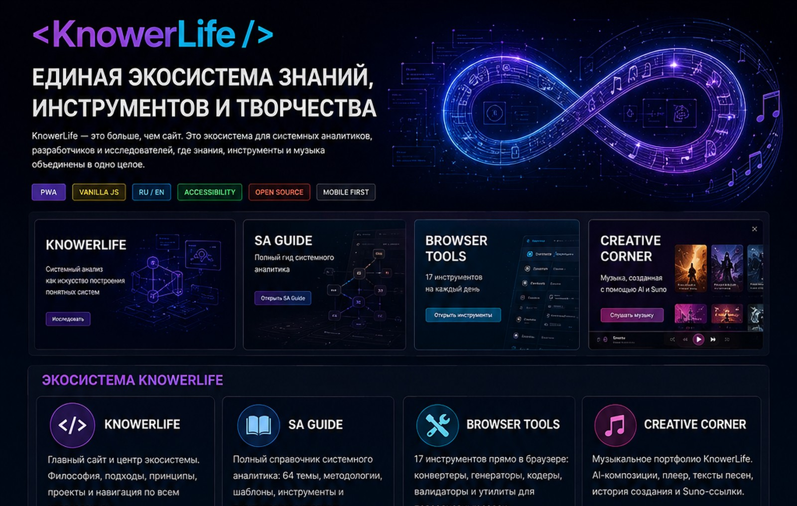
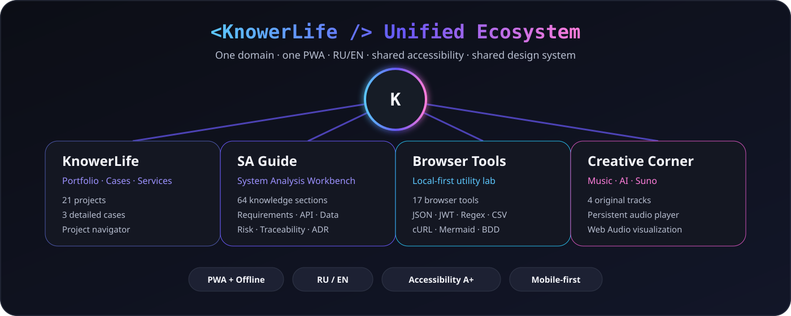
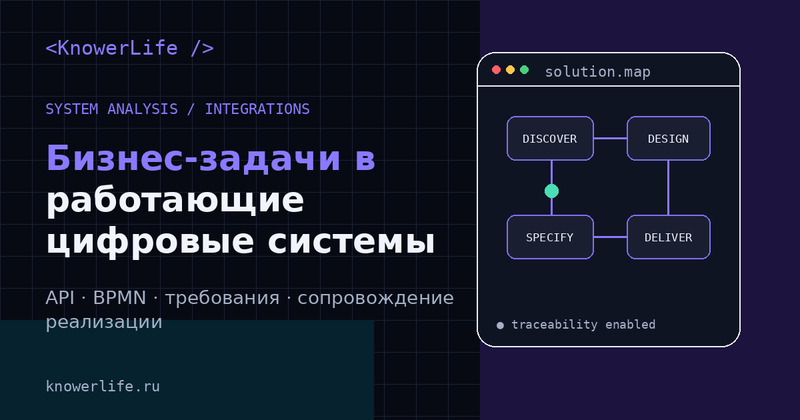
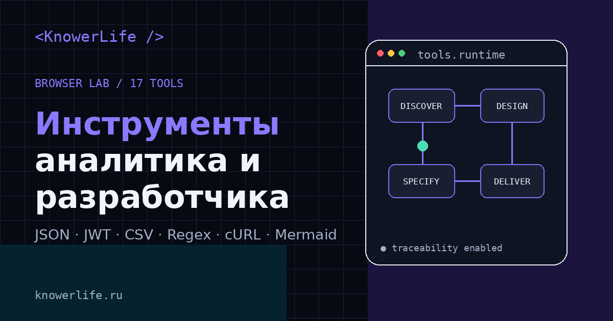
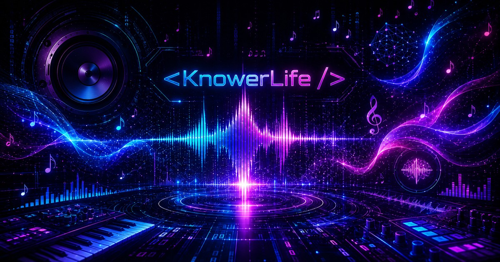
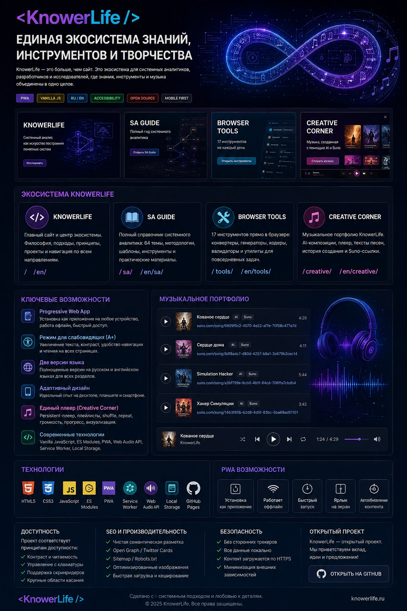

# `<KnowerLife />`

[](https://knowerlife.ru/)
[](https://github.com/KnowerLife/knowerlife)
[](https://knowerlife.ru/)
[](https://knowerlife.ru/en/)
[](https://knowerlife.ru/)
[](https://github.com/KnowerLife/knowerlife)
[](https://pages.github.com/)

<p align="center">
  <a href="https://knowerlife.ru/">
    
  </a>
</p>

**KnowerLife** — единая технологическая экосистема, объединяющая профессиональное портфолио, системный анализ, локальные browser-инструменты и музыкальное AI-творчество.

Один домен. Один дизайн-язык. Один root-PWA. Полноценные **RU/EN версии**, общий режим повышенной доступности **A+**, offline-возможности и единая навигация между всеми направлениями.

🌐 **Production:** [https://knowerlife.ru/](https://knowerlife.ru/)

---

## Содержание

- [Экосистема KnowerLife](#экосистема-knowerlife)
- [Основной KnowerLife](#основной-knowerlife)
- [SA Guide](#sa-guide)
- [Browser Tools](#browser-tools)
- [Creative Corner](#creative-corner)
- [RU / EN](#ru--en)
- [UX/UI](#uxui)
- [Доступность A+](#доступность-a)
- [PWA и offline](#pwa-и-offline)
- [Технологии](#технологии)
- [Архитектура](#архитектура)
- [SEO](#seo)
- [Производительность](#производительность)
- [Приватность и безопасность](#приватность-и-безопасность)
- [Quality & Testing](#quality--testing)
- [Структура репозитория](#структура-репозитория)
- [GitHub Pages и автоматизация](#github-pages-и-автоматизация)
- [Контакты](#контакты)
- [English summary](#english-summary)

---

# Экосистема KnowerLife

KnowerLife больше не является только портфолио.

В версии **v11.2** три самостоятельных проекта были объединены в один основной репозиторий и в одну систему:

```text
KnowerLife
│
├── Portfolio / Cases / Services
├── SA Guide
├── Browser Tools
└── Creative Corner
```

<p align="center">
  
</p>

| Направление | RU | EN | Что внутри |
|---|---|---|---|
| **KnowerLife** | [`/`](https://knowerlife.ru/) | [`/en/`](https://knowerlife.ru/en/) | Портфолио, услуги, кейсы, компетенции, процесс работы |
| **SA Guide** | [`/sa/`](https://knowerlife.ru/sa/) | [`/en/sa/`](https://knowerlife.ru/en/sa/) | 64 раздела системного анализа и Analyst Workbench |
| **Browser Tools** | [`/tools/`](https://knowerlife.ru/tools/) | [`/en/tools/`](https://knowerlife.ru/en/tools/) | 17 локальных инструментов аналитика и разработчика |
| **Creative Corner** | [`/creative/`](https://knowerlife.ru/creative/) | [`/en/creative/`](https://knowerlife.ru/en/creative/) | Музыкальное портфолио, Suno, AI Music и web-player |

Вся экосистема использует один основной домен, одну PWA-конфигурацию, один root Service Worker, общий набор favicon/PWA icons, единое состояние темы и доступности, общую визуальную систему и согласованную RU/EN-навигацию. В v11.2 поверх модулей работает единая **Ecosystem Shell**: общий header, footer, переключатель продуктов, mobile-dialog и единые controls RU/EN · A+ · Install · Light/Dark.

---

# Основной KnowerLife

<p align="center">
  <a href="https://knowerlife.ru/">
    
  </a>
</p>

Основная часть KnowerLife показывает работу на стыке системного анализа, интеграций, web-разработки и цифровых продуктов.

### Портфолио

- **21 проект**;
- системный анализ;
- корпоративные системы;
- web-разработка;
- SEO;
- e-commerce;
- SMM;
- автоматизация;
- Telegram-боты;
- open-source проекты;
- фильтрация;
- полнотекстовый поиск;
- grid / compact view.

### Подробные кейсы

**Корпоративные системы и документооборот** — системный анализ, BPMN, REST, 1С, роли, доступы, аудит и acceptance criteria.  
[Открыть кейс →](https://knowerlife.ru/cases/roscosmos/)

**Saunabani** — web development, information architecture, SEO, content и product growth.  
[Открыть кейс →](https://knowerlife.ru/cases/saunabani/)

**Интеграционный контур e-commerce** — API, события, 1С, доставка, retries, idempotency и integration contracts.  
[Открыть кейс →](https://knowerlife.ru/cases/integrations/)

### Project Navigator

Интерактивный навигатор связывает бизнес-задачу, контекст проекта и требуемую экспертизу с подходящим форматом работы.

---

# SA Guide

<p align="center">
  <a href="https://knowerlife.ru/sa/">
    
  </a>
</p>

**SA Guide** — база знаний системного аналитика и рабочая среда внутри KnowerLife. В актуальной версии — **64 раздела**.

Основные направления:

- Discovery, Problem Statement, Business Goals, Impact Mapping, Story Mapping;
- функциональные и нефункциональные требования;
- baseline, Change Request, Impact Analysis, scope management;
- Acceptance Criteria, Given/When/Then, traceability;
- BPMN, Use Cases, User Stories, UML, Sequence, State, Component, Deployment, C4, DMN;
- REST, SOAP, GraphQL, OpenAPI, HTTP, pagination, filtering, sorting, versioning;
- webhooks, polling, CDC, Kafka, RabbitMQ, DLQ;
- timeout, retry, backoff, jitter, idempotency, Circuit Breaker, Outbox, Saga;
- SQL, normalization, ACID, isolation, locking, consistency, caching;
- OAuth 2, OIDC, JWT, RBAC, ABAC, STRIDE, OWASP;
- testing, migration, rollback, feature flags, Logs, Metrics, Traces, Alerts, SLO.

### Analyst Workbench

Внутри доступны:

- Requirement Quality Checker;
- Acceptance Criteria Builder;
- SLA Calculator;
- PERT Calculator;
- HTTP Status Reference;
- Risk Matrix;
- Traceability Matrix;
- ADR / Decision Log;
- API Tester;
- SQL modeler;
- Notes;
- Meeting Timer;
- Requirements Checklist;
- Security Checklist;
- Competency Map;
- шаблоны SRS / API Specification / Test Case.

[Открыть SA Guide →](https://knowerlife.ru/sa/)

---

# Browser Tools

<p align="center">
  <a href="https://knowerlife.ru/tools/">
    
  </a>
</p>

Browser Tools — **17 локальных утилит**, работающих непосредственно в браузере.

| № | Инструмент | Назначение |
|---:|---|---|
| 1 | Безопасный пароль | Web Crypto + оценка энтропии |
| 2 | UUID v4 | Генерация идентификаторов |
| 3 | SHA-хеш | SHA-256 / SHA-384 / SHA-512 |
| 4 | JSON Formatter | Проверка, format, minify, sort |
| 5 | JSON Diff | Added / removed / changed paths |
| 6 | Base64 | UTF-8 encode / decode / URL-safe |
| 7 | Шифр Цезаря | Учебное преобразование RU/EN |
| 8 | URL Toolkit | Разбор URL и query params |
| 9 | JWT Decoder | Header, payload, time claims |
| 10 | Unix Timestamp | Seconds / milliseconds / local time |
| 11 | CSV ↔ JSON | Двусторонняя конвертация |
| 12 | Regex Tester | Match, groups, replacement preview |
| 13 | Text & Slug | Статистика текста и slug |
| 14 | User Story + BDD | Story + checklist + Given/When/Then |
| 15 | API Request → cURL | Подготовка команды cURL |
| 16 | Mermaid Sequence | Генерация sequence diagram source |
| 17 | Project Brief | Structured Markdown для discovery |

[Открыть Browser Tools →](https://knowerlife.ru/tools/)

---

# Creative Corner

<p align="center">
  <a href="https://knowerlife.ru/creative/">
    
  </a>
</p>

**Creative Corner** — творческая часть KnowerLife, где код, AI и музыка существуют в одном пространстве.

```text
Idea
  ↓
Lyrics / Mood / Concept
  ↓
AI-assisted production
  ↓
Suno
  ↓
Track
  ↓
Web experience
```

### Текущая коллекция

| Композиция | Suno |
|---|---|
| **Кованое сердце** | [Открыть](https://suno.com/song/6809f5c2-4070-4e22-af7e-70f58c477a7d) |
| **Сердце дома** | [Открыть](https://suno.com/song/8df8adc7-d80d-4257-b8a1-3a679b2cec14) |
| **Simulation Hacker** | [Открыть](https://suno.com/song/a3bf799e-6cb0-4b1f-84cd-706ffa7cbdb4) |
| **Хакер Симуляции** | [Открыть](https://suno.com/song/1463f85b-b2d9-4d5f-83bc-5ba69ad51101) |

Creative Corner включает persistent player, previous/next, seek, volume, shuffle, repeat, favorites, share, deep links, Media Session API и Web Audio visualization.

Музыкальный каталог хранится в `creative/data/tracks.json` и валидируется через `creative/data/tracks.schema.json`.

Аудио не входит в основной PWA app shell, а Service Worker не перехватывает `Range`-запросы к MP3 — это сохраняет корректную перемотку и потоковое воспроизведение.

### Light / Dark readability

Creative Corner использует отдельные semantic colors для светлых поверхностей и для тёмного фотографического hero. Это позволяет сохранить фирменный cyan / violet / magenta, но не жертвовать читаемостью.

| Состояние | Контраст |
|---|---:|
| Muted text на белом | **7.11:1** |
| Cyan accent на белом | **5.93:1** |
| Pink accent на белом | **7.02:1** |
| Violet accent на белом | **7.92:1** |
| Hero text на тёмном фоне | **18.99:1** |
| Hero cyan на тёмном фоне | **12.20:1** |
| Hero pink на тёмном фоне | **9.52:1** |

Контраст проверяется автоматически скриптом `scripts/check_creative_contrast.py`.

[Открыть Creative Corner →](https://knowerlife.ru/creative/)

---

# RU / EN

KnowerLife имеет полноценную двуязычную структуру.

| RU | EN |
|---|---|
| `/` | `/en/` |
| `/tools/` | `/en/tools/` |
| `/sa/` | `/en/sa/` |
| `/creative/` | `/en/creative/` |
| `/privacy/` | `/en/privacy/` |
| `/site-map/` | `/en/site-map/` |

Используются локализованные title/description, canonical, `hreflang`, Open Graph, Twitter Cards и structured data.

---

# UX/UI

Все части проекта используют один визуальный язык:

```text
Dark navy / near black
#6757f5 violet
Blue / cyan accents
Restrained magenta accents
Glass-like surfaces
Technical diagrams
Mono typography accents
System sans-serif UI
```

### Unified Ecosystem Shell

Все 17 HTML-страниц получают одну общую оболочку поверх собственной модульной логики:

- `<KnowerLife />` + название текущего продукта;
- переключатель **Ecosystem** между Main / SA Guide / Browser Tools / Creative Corner;
- контекстная навигация «на этой странице» отдельно от глобальной;
- единые RU/EN, A+, Install и Light/Dark controls;
- единый mobile `dialog`;
- общий footer с продуктами, service links и контактами.

Так SA Guide и Creative Corner сохраняют собственные интерфейсные особенности, но перестают ощущаться отдельными сайтами.

Общие UX-принципы:

- mobile-first;
- desktop / tablet / mobile;
- единая навигация между продуктами;
- sticky header;
- native dialogs;
- крупные touch targets;
- clear focus states;
- light / dark theme;
- responsive typography;
- no horizontal overflow;
- `prefers-reduced-motion`;
- progressive enhancement;
- читаемые текстовые подложки поверх графических фонов.

---

# Доступность A+

В KnowerLife есть общий режим повышенной доступности. Его состояние сохраняется под единым ключом:

```text
knowerlife-accessibility
```

Поэтому настройка переносится между Home, SA Guide, Tools и Creative Corner.

Режим A+ усиливает:

- размер текста;
- line-height;
- контраст;
- заметность borders;
- размеры controls;
- keyboard navigation;
- focus visibility;
- снижение интенсивности анимаций;
- читаемость текста на сложных фонах.

Дополнительно используются semantic HTML, skip links, accessible names, `aria-*`, native `dialog`, `prefers-reduced-motion` и touch-friendly controls.

Для Creative Corner A+ работает вместе с отдельными high-contrast light-theme tokens: мелкие подписи, фильтры, теги, favorite-state и player metadata остаются различимыми и в светлой, и в тёмной схеме.

---

# PWA и offline

Вся экосистема работает как **одно устанавливаемое приложение KnowerLife**.

```text
KnowerLife PWA
│
├── Main
├── SA Guide
├── Browser Tools
└── Creative Corner
```

Корневой `manifest.webmanifest` содержит отдельные `purpose:any`, `purpose:maskable` и `purpose:monochrome` и shortcuts на SA Guide, Browser Tools, Creative Corner и Portfolio.

Стратегии:

```text
Navigation        → network-first
CSS / JavaScript  → stale-while-revalidate
Images            → cache-first
Audio / Range     → native network handling
```

Это даёт установку на desktop/mobile, standalone mode, offline fallback, app shortcuts, быстрый повторный запуск и единое обновление кэша.

---

# Технологии

### Frontend

- Semantic HTML5;
- CSS3;
- CSS Grid;
- Flexbox;
- CSS Custom Properties;
- fluid typography;
- responsive layout;
- Vanilla JavaScript;
- ES Modules;
- DOM API;
- Fetch API;
- AbortController;
- Clipboard API;
- Local Storage;
- Intersection Observer;
- Dialog API.

### Analysis & Tools

- Web Crypto API;
- JSON;
- JWT;
- Regex;
- CSV;
- UUID;
- Base64;
- Mermaid source generation;
- BDD helpers.

### Music

- HTML Audio API;
- Web Audio API;
- AudioContext;
- AnalyserNode;
- Canvas;
- Media Session API;
- Web Share API;
- JSON music catalog.

### PWA

- Web App Manifest;
- Service Worker;
- Cache Storage API;
- offline fallback;
- maskable / monochrome icons.

### Platform

- GitHub;
- GitHub Pages;
- GitHub Actions;
- custom domain;
- HTTPS;
- static architecture.

---

# Архитектура

KnowerLife остаётся статическим проектом без обязательного собственного backend.

```text
                     GitHub Pages
                          │
                    knowerlife.ru
                          │
                   Root Service Worker
                          │
      ┌───────────────────┼───────────────────┐
      │                   │                   │
  Main / Cases         SA Guide          Creative Corner
      │                   │                   │
 Browser Tools        Workbench          Audio / Suno
      │                   │                   │
      └──────────── shared UI / PWA / A+ ─────┘
```

Функциональные модули остаются независимыми внутри своих каталогов, но пользователь воспринимает их как одну платформу.

---

# SEO

Проект использует отдельные индексируемые HTML-страницы, а не SPA-router.

Используются:

- semantic page structure;
- unique titles/descriptions;
- canonical;
- RU/EN `hreflang`;
- Open Graph;
- Twitter Cards;
- JSON-LD;
- sitemap.xml;
- robots.txt;
- human-readable site map;
- social previews.

Structured data применяется для `WebSite`, `Organization`, `WebPage`, `Article`, `BreadcrumbList`, `ItemList` и `WebApplication`.

---

# Производительность

KnowerLife сознательно не использует тяжёлый UI-framework.

Основные решения:

- Vanilla JavaScript;
- static hosting;
- small app shell;
- local assets;
- runtime/lazy loading;
- большие MP3 вне initial PWA cache;
- оптимизированные preview images;
- системные шрифты;
- минимум внешних runtime-зависимостей.

---

# Приватность и безопасность

Большая часть функций выполняется локально.

В `localStorage` могут сохраняться theme, accessibility mode, bookmarks, last position, SA notes/checklists, Risk Matrix, Traceability Matrix, ADR и Creative Corner favorites.

Browser Tools обрабатывают данные непосредственно в браузере.

Проект контролирует отсутствие `eval()`, `document.write()`, inline `onclick` и небезопасных `innerHTML` assignments.

---

# Quality & Testing

Основной check-suite запускается через:

```text
npm run check
```

Он включает HTML integrity, portfolio integrity, Browser Tools, identity, responsive layout, accessibility, security, performance budgets, SEO, JavaScript syntax, **17-page Ecosystem Shell coverage**, unified ecosystem integrity, SA module integrity, Creative Corner integrity, **Creative light/dark contrast regression** и unit tests.

Текущее покрытие:

```text
Portfolio projects:       21
Detailed cases:            3
Browser Tools RU:         17
Browser Tools EN:         17
SA sections RU:           64
SA sections EN:           64
Creative tracks:           4

Browser Tools tests:      16 passed
Creative Core tests:       5 passed
```

Финальный Chromium smoke для объединённой версии:

```text
20 / 20 ecosystem checks passed
Creative light-theme fixture: desktop + mobile, horizontal overflow = 0
```

Проверялись Home RU/EN, SA RU/EN, Creative RU/EN, desktop/mobile, search, filters, A+, dialogs, player-related UI states и responsive overflow.

---

# Структура репозитория

```text
knowerlife/
├── index.html
├── 404.html
├── offline.html
│
├── en/
│   ├── index.html
│   ├── tools/
│   ├── sa/
│   ├── creative/
│   ├── privacy/
│   └── site-map/
│
├── tools/
├── sa/
├── creative/
├── cases/
├── privacy/
├── site-map/
│
├── assets/
│   ├── css/
│   │   ├── styles.css
│   │   └── ecosystem-shell.css
│   ├── js/
│   │   ├── main.js
│   │   └── ecosystem-shell.js
│   ├── icons/
│   ├── readme/
│   └── seo/
│
├── manifest.webmanifest
├── service-worker.js
├── browserconfig.xml
├── sitemap.xml
├── robots.txt
├── CNAME
├── package.json
└── README.md
```

---

# GitHub Pages и автоматизация

GitHub Actions используются для Pages deployment, quality checks, IndexNow и миграции музыкальных MP3 при необходимости.

Перед публикацией unified-версии выполняются проверки основной платформы и отдельных модулей.

---

# Полная визуальная карта

<p align="center">
  
</p>

---

# Контакты

- 🌐 [knowerlife.ru](https://knowerlife.ru/)
- 🐙 [github.com/KnowerLife](https://github.com/KnowerLife)
- ✈️ [Telegram](https://t.me/knowerlife)
- 📘 [VK](https://vk.com/knowerlife)
- 🎵 [Suno](https://suno.com/@knowerlife)
- 📧 [info@knowerlife.ru](mailto:info@knowerlife.ru)

---

# English summary

**KnowerLife** is a unified static ecosystem for system analysis, developer utilities, professional case studies and AI-assisted music.

It combines:

- **KnowerLife** — portfolio, services and detailed cases;
- **SA Guide** — 64 system-analysis sections and an interactive analyst workbench;
- **Browser Tools** — 17 local-first utilities;
- **Creative Corner** — an AI-assisted music portfolio with a persistent web audio player.

The platform provides Russian and English versions, one installable PWA, offline fallback, shared accessibility mode, light/dark themes, responsive desktop/tablet/mobile UI, local-first browser processing, SEO-friendly static pages and automated quality checks. Version 11.2 also introduces a shared ecosystem header/footer/navigation shell and dedicated high-contrast semantic colors for Creative Corner in light mode.

### Quick links

- [Main website](https://knowerlife.ru/)
- [SA Guide](https://knowerlife.ru/sa/)
- [Browser Tools](https://knowerlife.ru/tools/)
- [Creative Corner](https://knowerlife.ru/creative/)
- [English version](https://knowerlife.ru/en/)

---

<p align="center">
  <strong>&lt;KnowerLife /&gt;</strong><br>
  System Analysis · Tools · Integrations · Creative Technology
</p>
